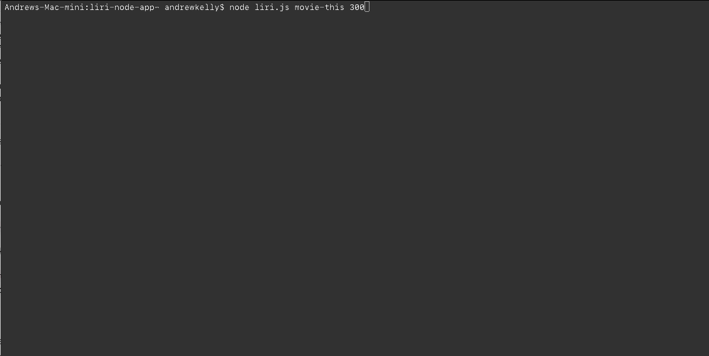

# LIRI
### node.js console application . 
###  LIRI is a command line node app that takes in parameters and displays data.
search for concerts, songs, and movies.  
To search for concerts use: **node liri.js concert-this <artist/band name here>**  
To search for songs use: **node liri.js spotify-this-song '<song name here>'**  
To search for movies use: **node liri.js movie-this '<movie name here>'**  
* Using the Bands In Town API
    * 
* Using the Spotify API
    * 
* Using the OMDB API
    * 
